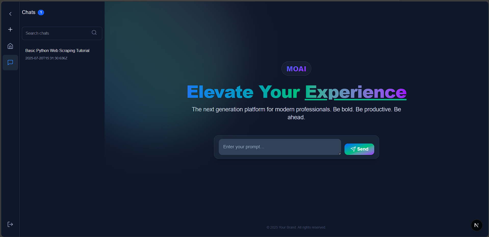
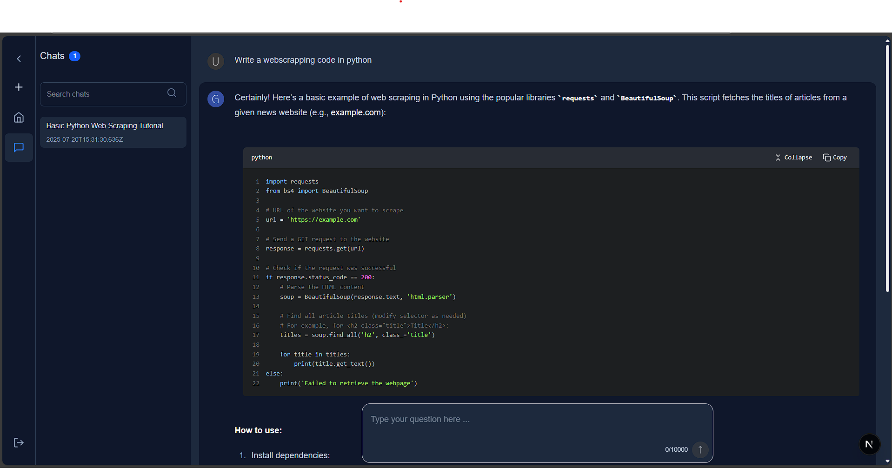

# 🤖 MoAI




MoAI is a full-stack, modern AI chat platform featuring a Next.js frontend and a Node.js/Express backend. It offers real-time chat, user authentication, and seamless integration with external APIs and AI services.

---

## 🗂️ Project Structure

```
MoAI/
  client/   # Next.js frontend (React, TypeScript)
  server/   # Node.js/Express backend (TypeScript, MongoDB)
```

- **client/**: Frontend web app (Next.js, React, Tailwind CSS, NextAuth.js)
- **server/**: Backend API (Express, MongoDB, JWT, HuggingFace, OpenAI, MCP)

---

## ✨ Features

- 🔐 **User Authentication** (NextAuth.js, JWT)
- 💬 **Real-time Chat Interface**
- 🧵 **Chat Threads & History**
- 🧠 **AI Integrations**: HuggingFace, Azure OpenAI, Model Context Protocol (MCP)
- 🌐 **Web & Weather API Tools**
- ⚙️ **User Settings & Profile Management**
- 🖥️ **Modern, Responsive UI**

---

## 🚀 Getting Started

### Prerequisites
- Node.js (v16+ recommended)
- npm or yarn
- MongoDB instance (local or cloud)

### Installation

1. **Clone the repository:**
   ```bash
   git clone <repo-url>
   cd MoAI
   ```
2. **Install dependencies for both client and server:**
   ```bash
   cd client && npm install
   cd ../server && npm install
   ```
3. **Set up environment variables:**
   - Copy `.env.example` to `.env` in both `client/` and `server/` directories and fill in the required values.
4. **Run the development servers:**
   - **Client:**
     ```bash
     cd client
     npm run dev
     ```
   - **Server:**
     ```bash
     cd server
     npm run dev
     ```

---

## 🏗️ Folder Structure

### Client (`client/`)
```
client/
  src/
    app/
      (authenticated)/      # Protected routes (chat, home, etc.)
      layout.tsx            # Root layout
      page.tsx              # Landing page
      globals.css           # Global styles
    components/             # UI components (Chat, Sidebar, etc.)
    contexts/               # React context providers
    features/               # Feature modules (auth, navigation, etc.)
    lib/                    # Utility libraries (JWT, MongoDB, etc.)
    services/               # API service functions
    types/                  # TypeScript types and declarations
  public/                   # Static assets (SVGs, screenshot, etc.)
```

### Server (`server/`)
```
server/
  src/
    db.ts                # MongoDB connection
    index.ts             # Entry point
    middleware/          # Express middlewares
    models/              # Mongoose models
    routes/              # API route handlers
    services/            # Service logic (e.g., AOAI)
    tools/               # Utility tools (web, weather, etc.)
    interface/           # TypeScript interfaces
```

---

## 🖥️ Main UI Routes
| Path            | Description                       |
|-----------------|-----------------------------------|
| `/`             | Landing page                      |
| `/chat`         | Chat interface (authenticated)    |
| `/chat/[id]`    | Individual chat thread            |
| `/unauthorized` | Unauthorized access page          |

---

## 🛠️ API Overview
| Route                        | Description                        |
|------------------------------|------------------------------------|
| `/api/user`                  | User authentication & management   |
| `/api/huggingFace/chat`      | Hugging Face API integration       |
| `/api/chat`                  | Chat operations                    |
| `/api/chat-threads`          | Chat thread management             |
| `/api/chat-messages`         | Chat message management            |
| `/api/mcp`                   | Model Context Protocol (MCP) API   |

> All routes (except `/api/mcp`) require authentication via JWT.

---

## 🧩 Key Components & Tech
- **Frontend:** Next.js 15, React 19, TypeScript, Tailwind CSS, NextAuth.js
- **Backend:** Node.js, Express, MongoDB, Mongoose, JWT, HuggingFace(Open Source model), OpenAI, MCP
- **Integrations:**
  - 🔗 HuggingFace (AI Inference)
  - 🔗 Azure OpenAI
  - 🔗 Model Context Protocol (MCP)
  - 🌦️ OpenWeatherMap (weather)
  - 🌐 Serper (web search)
- **UI Components:**
  - `ChatContainer`, `ChatList`, `ChatMessage` — Chat UI
  - `SideBar` — Navigation sidebar
  - `NewChat` — Chat thread actions
  - `MarkdownCodeBlock` — Markdown/code rendering

---

## ⚙️ Environment Variables
- **Client:** See `.env.example` in `client/` for NextAuth, API URLs, etc.
- **Server:** See `.env.example` in `server/` for MongoDB, API keys, etc.
  - `DB` — MongoDB connection string (required)
  - `PORT` — Port to run the server (optional, defaults to 8080)
  - `OPENWEATHER_API_KEY` — API key for OpenWeatherMap
  - `SERPER_API_KEY` — API key for Serper web search
  - `FIRECRAWL_API_KEY` — API key for Firecrawl web scraping

---

## 📦 Scripts
- **Client:**
  - `npm run dev` — Start development server
  - `npm run build` — Build for production
  - `npm start` — Start production server
  - `npm run lint` — Lint codebase
- **Server:**
  - `npm run dev` — Start server with hot-reloading
  - `npm start` — Start server in production mode

---

## 📄 License
MIT

---

## 🙏 Credits

### 🛠️ Technologies & Libraries
- **Frontend Framework**: [Next.js](https://nextjs.org/) - React framework for production
- **UI Framework**: [Tailwind CSS](https://tailwindcss.com/) - Utility-first CSS framework
- **Authentication**: [NextAuth.js](https://next-auth.js.org/) - Complete authentication solution
- **Backend Framework**: [Express.js](https://expressjs.com/) - Fast, unopinionated web framework
- **Database**: [MongoDB](https://www.mongodb.com/) - NoSQL database
- **AI Services**: 
  - [Hugging Face](https://huggingface.co/) - Open source AI models
  - [Azure OpenAI](https://azure.microsoft.com/en-us/products/ai-services/openai-service) - Enterprise AI services
  - [Model Context Protocol (MCP)](https://modelcontextprotocol.io/) - AI model integration protocol

### 🎨 UI Components & Design
- **Chat UI Skeleton**: [Langui.dev Components](https://www.langui.dev/components) - Modern chat interface components and design patterns
- Icons provided by [Lucide React](https://lucide.dev/) - Beautiful & consistent icon toolkit
- UI components inspired by modern design systems

### 📚 Learning Resources
- Next.js documentation and examples
- React patterns and best practices
- MongoDB and Express.js tutorials

---

## 🙌 Contributing
Pull requests and issues are welcome! For major changes, please open an issue first to discuss what you would like to change.

---

## 💡 Tips
- For more details, see the source code in each folder and the sub-READMEs in `client/` and `server/`.

