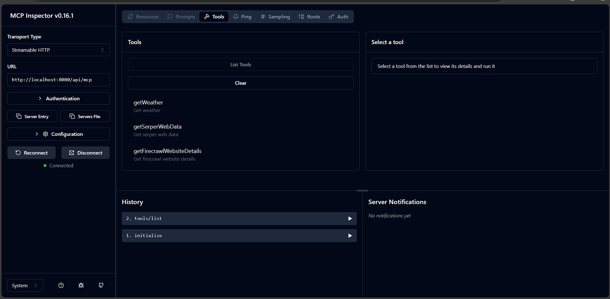

# MoAI Server (API)

This is the backend API for the MoAI project. It provides endpoints for authentication, chat, integration with multiple AI services (Azure OpenAI, Google Gemini, HuggingFace), and the Model Context Protocol (MCP). The server is built with Node.js, Express, and TypeScript, and uses MongoDB for data storage.

## ✨ Features
- **User authentication and management** with JWT
- **Advanced chat system** with message regeneration and version control
- **Multi-AI Model Support**: Azure OpenAI, Google Gemini, and HuggingFace
- **Model Context Protocol (MCP)** with web-based inspector
- **External API integrations**: Web search, website parsing, weather data
- **Secure JWT-based authentication** with middleware protection

## 📚 Documentation

For detailed guides and feature explanations, visit our **[Documentation Hub](../docs/README.md)**:

- **[AI Model Setup](../docs/MODEL_SETUP.md)** - Complete configuration for all supported models
- **[Message Regeneration Features](../docs/MESSAGE_REGENERATION_FEATURE.md)** - Advanced chat capabilities
- **[Main Project README](../README.md)** - Complete project overview

## 🏗️ Folder Structure
```
server/
  src/
    db.ts                # MongoDB connection
    index.ts             # Entry point
    middleware/          # Express middlewares
    models/              # Mongoose models
    routes/              # API route handlers
    services/            # Service logic (AI integrations)
    tools/               # MCP tool implementations
    interface/           # TypeScript interfaces
```

## 🚀 Setup & Installation
1. **Clone the repository**
2. **Install dependencies:**
   ```bash
   cd server
   npm install
   ```
3. **Configure environment variables:**
   Create a `.env` file in the `server/` directory with the required variables (see [AI Model Setup](../docs/MODEL_SETUP.md) for complete configuration).

## 🖥️ Running the Server
- **Development:**
  ```bash
  npm run dev
  ```
- **Production:**
  ```bash
  npm start
  ```

## 📦 Scripts
- `npm run dev` — Start server with hot-reloading (nodemon, TypeScript)
- `npm start` — Start server in production mode
- `npm run inspector` — Launch the MCP Inspector UI for testing and debugging MCP tools

## 🔧 MCP Inspector

The MCP Inspector is a web-based tool for testing and debugging MCP tools implemented in this server.

### How to Run MCP Inspector
1. Make sure your server is running (e.g., with `npm run dev`).
2. In a separate terminal, run:
   ```bash
   npm run inspector
   ```
   This will launch the MCP Inspector UI in your browser.

### Screenshot


---

## 🛠️ MCP API

The MCP API allows you to call various tools via JSON-RPC 2.0. Each tool is exposed as a callable method with a specific set of arguments.

### How to Call a Tool

To call a tool, send a JSON-RPC 2.0 request with the following structure:

```json
{
  "jsonrpc": "2.0",
  "method": "tools/call",
  "params": {
    "name": "<toolName>",
    "arguments": {
      // tool-specific arguments
    }
  },
  "id": "<uniqueId>"
}
```

### Example Requests

#### 1. getSerperWebData

```json
{
  "jsonrpc": "2.0",
  "method": "tools/call",
  "params": {
    "name": "getSerperWebData",
    "arguments": {
      "query": "latest AI news"
    }
  },
  "id": "getSerperWebData"
}
```

#### 2. getFirecrawlWebsiteDetails

```json
{
  "jsonrpc": "2.0",
  "method": "tools/call",
  "params": {
    "name": "getFirecrawlWebsiteDetails",
    "arguments": {
      "url": "https://example.com"
    }
  },
  "id": "getFirecrawlWebsiteDetails"
}
```

#### 3. getWeather

```json
{
  "jsonrpc": "2.0",
  "method": "tools/call",
  "params": {
    "name": "getWeather",
    "arguments": {
      "location": "San Francisco"
    }
  },
  "id": "getWeather"
}
```

## 🎯 New Features

### Message Regeneration & Version Control
- **Regenerate Endpoint**: `/api/chat/regenerate` for creating new AI response versions
- **Version Management**: Store and manage multiple versions of AI messages
- **Context Preservation**: Maintain conversation context during regeneration
- **Version Navigation**: API support for switching between message versions

### Enhanced AI Model Support
- **Azure OpenAI**: Full streaming and tool calling support
- **Google Gemini**: Advanced conversation handling with gemini-2.5-flash
- **HuggingFace**: Open-source model integration
- **Smart Fallback**: Automatic model selection based on availability

### MCP Tool Integration
- **Web Search**: Real-time information retrieval via Serper API
- **Website Analysis**: Detailed webpage content extraction via Firecrawl
- **Weather Data**: Current weather information via OpenWeatherMap
- **Tool Inspector**: Web-based interface for testing MCP tools

## 🛣️ API Routes Overview
| Route                        | Description                        | Auth Required |
|------------------------------|------------------------------------|---------------|
| `/api/user`                  | User authentication & management   | ❌ (login) / ✅ |
| `/api/huggingFace/chat`      | Hugging Face API integration       | ✅ |
| `/api/chat`                  | Chat operations & regeneration     | ✅ |
| `/api/chat-threads`          | Chat thread management             | ✅ |
| `/api/chat-messages`         | Chat message management & versions | ✅ |
| `/api/mcp`                   | Model Context Protocol endpoints   | ❌ |

> All routes (except `/api/mcp`) require authentication via JWT.

## 🔧 Environment Variables
- `DB` — MongoDB connection string (required)
- `PORT` — Port to run the server (optional, defaults to 8080)
- `AZURE_OPENAI_API_KEY` — Azure OpenAI API key
- `AZURE_OPENAI_API_INSTANCE_NAME` — Azure OpenAI instance name
- `AZURE_OPENAI_API_DEPLOYMENT_NAME` — Azure OpenAI deployment name
- `GEMINI_API_KEY` — Google Gemini API key
- `HUGGINGFACE_API_KEY` — HuggingFace API key
- `OPENWEATHER_API_KEY` — API key for OpenWeatherMap
- `FIRECRAWL_API_KEY` — API key for Firecrawl web scraping
- `SERPER_API_KEY` — API key for Serper web search

## 📦 Dependencies
- **Core**: express, mongoose, dotenv, cors, bcrypt, jsonwebtoken
- **AI Services**: @huggingface/inference, @modelcontextprotocol/sdk, openai
- **Utilities**: axios, joi
- **Development**: TypeScript, ts-node, nodemon

## 🚀 Performance & Scalability
- **Connection Pooling**: Optimized MongoDB connections
- **Middleware Caching**: Efficient request processing
- **Error Handling**: Comprehensive error management and logging
- **Rate Limiting**: Built-in protection against abuse
- **CORS Configuration**: Secure cross-origin resource sharing

## 📖 Additional Resources
- **[Client Documentation](../client/README.md)** - Frontend development guide
- **[Project Overview](../README.md)** - Complete project information
- **[Feature Documentation](../docs/README.md)** - Detailed guides for all features

## �� License
MIT

---
